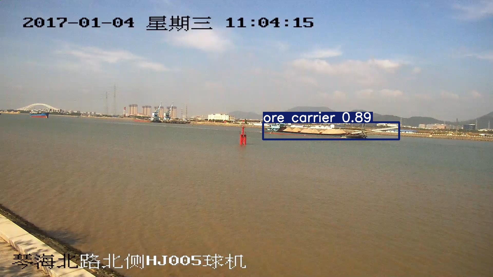
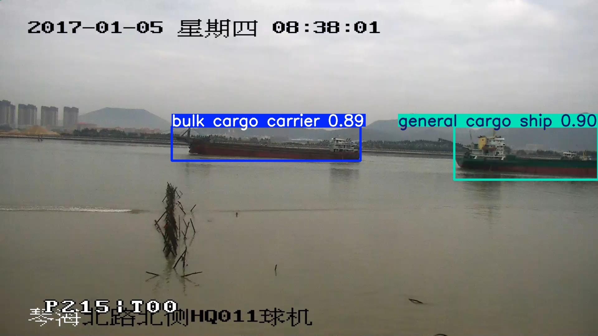

# MVD-YOLOv8
Marine Vessel Detection-YOLOv8 (MVD-YOLOv8) for improving the performance of marine vessel detection.

# Output



# Training
1. Clone the resposity
```
git clone https://github.com/zhuansunyuqing/MVD-YOLOv8.git
cd MVD-YOLOv8
```

2. Install Requirements
```
pip install -r requirements.txt
```
3. Download the datasets
>SeaShips: https: //github.com/jiaming-wang/SeaShips  
>Ship-Detection: https://universe.roboflow.com/yolo-fruit-team4/ship-detection-jxcyp  
>Ships/Vessels in Aerial Images: https://www.kaggle.com/datasets/siddharthkumarsah/ships-in-aerial-images?resource=download  
   
4. Load and train a YOLOv8n model
* The training code is as followed: 
```
python train.py
```
* After training, the result models will be saved in `runs` folder.

# Results
| Model | bulk cargo carrier | container ship | fishing boat | general cargo ship | ore carrier | passenger ship | mAP50:95 |
|--------|--------|--------|--------|--------|--------|--------|--------|
| YOLOv8n | 0.83	| 0.867	| 0.775	| 0.857	| 0.816	| 0.795 |	0.823 |
| MVD-YOLOv8 |	**0.843**	| **0.883** |	**0.794** |	**0.868** |	**0.829** |	**0.849** |	**0.844** |


# Some issues to know
1. The environment is Python 3.8. For more details, please refer to requirements.txt.
2. Default anchors are used. If you use your own anchors, probably some changes are needed.

# Reference
Thanks to their great works.
* [ultralytics/yolov8](https://docs.ultralytics.com/zh/models/yolov8/)
